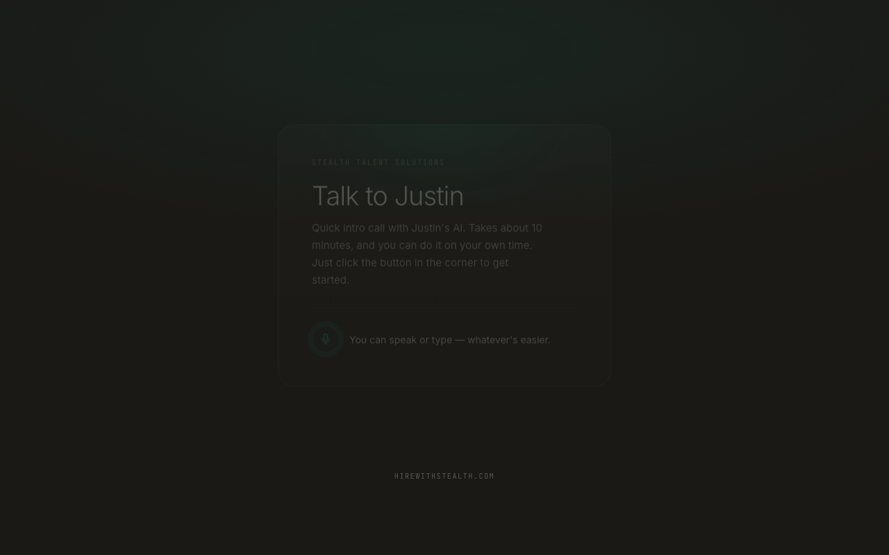
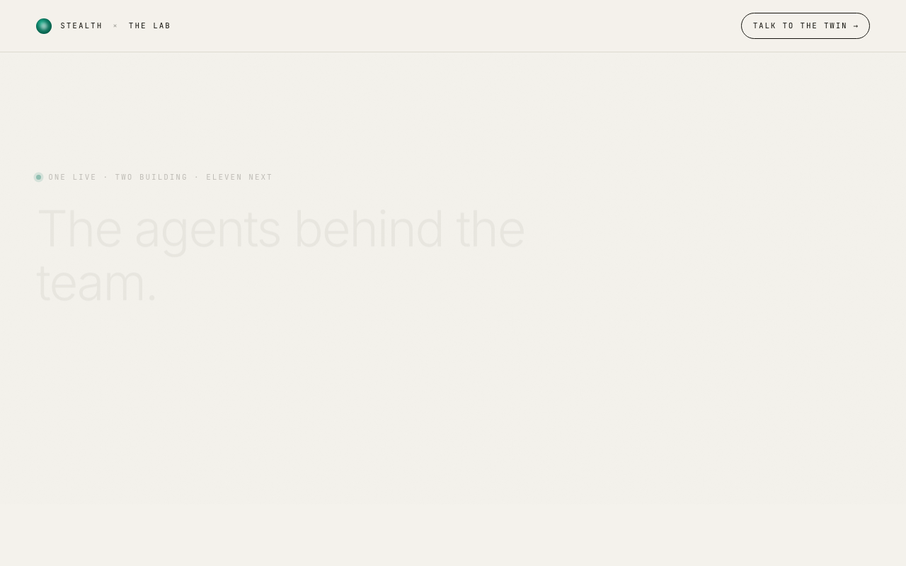

# The Lab — Stealth Talent Solutions

Two pages: an internal agent overview for the team, and a candidate-facing Digital Twin that runs pre-screening calls in Justin's voice.

## Live

| Page | URL | Audience |
|---|---|---|
| **Digital Twin** | [twin.html](https://localwolfpackai.github.io/stealth-the-lab/twin.html) | Candidates |
| **The Lab** | [index.html](https://localwolfpackai.github.io/stealth-the-lab/) | Internal team |

## Digital Twin



Standalone page with an ElevenLabs ConvAI widget. Candidates click the button, talk to Justin's AI, and the conversation data flows back to the platform. No login, no install — just a link.

- Voice: Justin's cloned voice via ElevenLabs
- Widget: speaks and accepts text input
- Agent: `agent_1201kqjsjpzyek7twj9tbepcasta` (public, no auth required)

## The Lab



Internal overview of the 14-agent roadmap. Shows what's live, what's building, and what's next. Not for candidates.

## Files

```
index.html          — The Lab (internal overview)
twin.html           — Digital Twin (candidate-facing)
archive/            — Earlier iterations (not deployed)
.github/workflows/  — GitHub Pages deploy
```

## Stack

Static HTML + CSS. No build step. Fonts loaded from Google Fonts. ElevenLabs widget loaded via their CDN script.

Deployed automatically to GitHub Pages on push to `main`.
