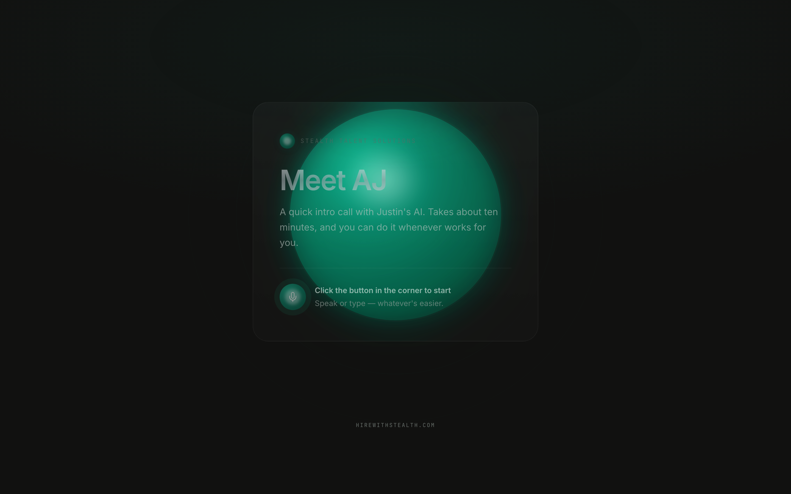

# The Lab — Stealth Talent Solutions

Internal agent overview + candidate-facing AI voice twin for pre-screening calls.

## Live

| Page | URL | Audience |
|---|---|---|
| **AJ** | [twin.html](https://localwolfpackai.github.io/stealth-the-lab/twin.html) | Candidates |
| **The Lab** | [index.html](https://localwolfpackai.github.io/stealth-the-lab/) | Internal team |

## AJ — Digital Twin

Candidates get a link, click the button, and talk to Justin's AI. Voice cloned via ElevenLabs. No login, no install.

## The Lab

Agent roadmap for the internal team. What's live, what's building, what's next.

## Stack

Static HTML + CSS. No build step. Deployed to GitHub Pages on push to `main`.
